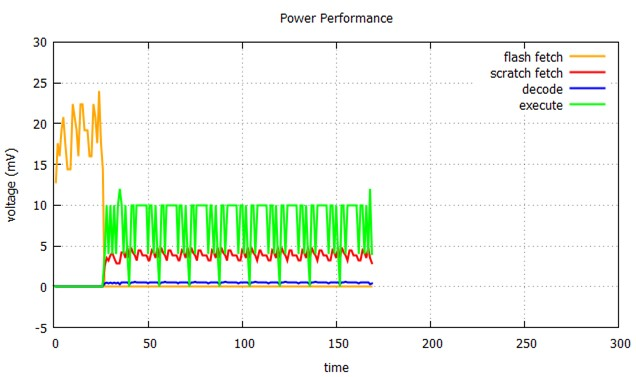
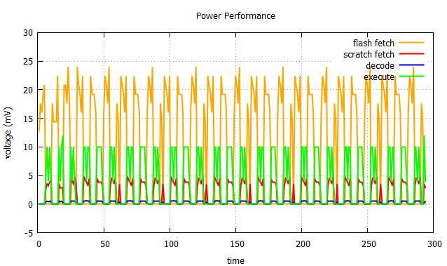
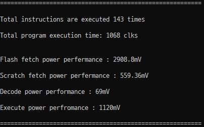
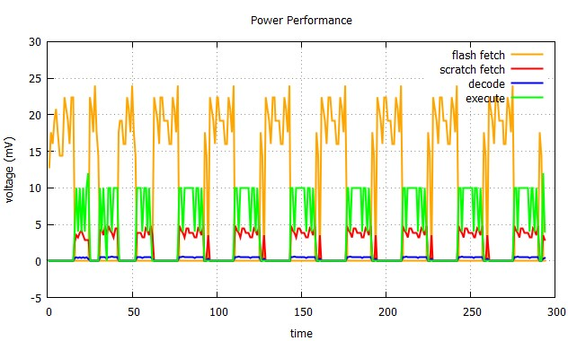
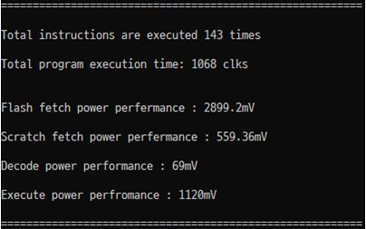
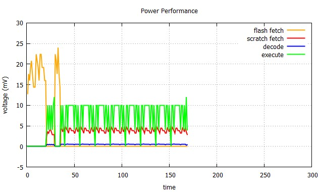
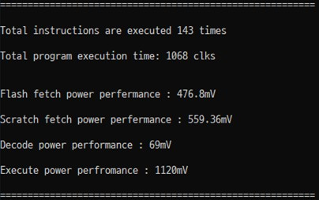
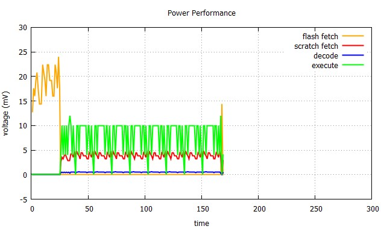
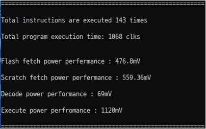

# ISS Variable Size Scratch pad 

## 0. Research Talk - (2019.03.18)

1. CPU는 가상 메모리를 사용해 차례대로 메모리 index가 올라가지만, physical memory는 달라질 수 있으므로 다양한 기능을 가진 코드 메모리 acess가 가능하다. 이 때 한 기능을 하는 클래스를 수정하면 연결된 블럭(ex. decode)도 수정해야 한다. 하지만 cpp로 작성하면 연결되는 블럭은 수정안해도 된다.(모듈화)


## 1. Concept

 이전 챕터에서 Scratch pad의 크기는 모든 명령어를 담을 수 있는 사이즈였다. 따라서 전력 패턴은 처음 한 번 flash에서 scratch pad로의 패치 한 번만 있었고 이 후 scratch pad에서만 fetch와 decode, execute가 일어난다. 이 전력 패턴을 gnuplot으로 나타냈을 때 아래와 같이 나타났었다.



하지만 scratch pad의 크기는 프로세서마다 다를 수 있고 시뮬레이터는 모든 케이스를 다를 수 있어야하기 때문에 scratch pad의 사이즈가 전체 명령어 크기보다 작을 때 어떻게 flash fetch를 할 것인지 동작을 정의해야한다. 이번 챕터에선 그 동작을 정의하도록 한다. 


## 2. Code Modulation

#### 2.1. sim.h

먼저 헤더 파일 수정이다. 헤더파일에 추가된 사항은 새로운 구조체의 선언이다. PAD라는 구조체를 새로 선언했는데 이는 현재 PC가 가르키는 명령어가 scratch pad에 있는 명령어인지 판단하기 위해 명령어 마다 PC 값을 추가하기 위함이다.

```c
typedef struct{
    int pc;
    char inst[17];
}PAD;
```

해당 코드를 추가한 전체 sim.h는 아래와 같다. 추가로 PAD_SIZE를 define해줬다. 사용자의 의도에 따라 scratch_pad의 크기를 달리하여 시뮬레이션 할 수 있을 것이다.

```c

#ifndef SIM
#define SIM


using namespace std;

#include <iostream>
#define LINE_NUM 1000
#define PAD_SIZE 26
enum {SUBS, MOVS, ADDS, CMP, ADD, STR, LDR, SUB, BGT, B}; 

typedef struct {
	int OPCODE;
	int opcode[3];
	int offset;
	int OP1;
	int OP2;
}instruction;

typedef struct{
		float flash_fetch;
		float scratch_fetch;
		float decode;
		float execute;
}power;

typedef struct{
		int pc;
		char inst[17];
}PAD;

int time = 0; // var for ploting time axis
static const unsigned int prog_size = 1024;
static const unsigned int mem_size = 256;
static const unsigned int regs = 16;

// memory
instruction program;
power p[LINE_NUM];

int memory[mem_size] = {0};

// function decleration
int decode(ifstream&, int, int);
int run_program(int*, int*);
void on_chip_debug( void);
void report_profile(int[], int[]);
void flash_fetch( FILE*, PAD*, int);
int scratch_fetch( PAD*, char*, int);
void decode_2(char *inst);
void plot_power_performance(int cnt);
#endif

```

#### 2.2. main.cpp

 main.cpp는 길어 수정한 부분( flash_fetch, scratch_fetch)만 발췌하였다. flash_fetch 함수는 입력 받는 PC 값에 따라 해당 라인의 명령어를 파일 스트림 버퍼에 넣고 이를 매개변수로 받은 scratch_pad.inst에 저장한다. 또한 해당 line을 scratch.pad.pc에 저장하여 scratch_fetch에서 실행할 명령어를 구분하게 한다. 나머지 동작은 유사하고 time이라는 전역 변수를 하나 선언해 모든 함수에서 접근하는 시간 변수를 동일하게 하였다. 또 scratch pad에 명령어가 없어 다시 flash_fetch를 하는 경우는 가장 간단하게 구현하였다. End of file이면 fetch를 멈추고 해당 필요한 부분이 생기면 scratch pad에서 이전에 실행한 명령어 위치 다음에 새로운 명령어를 저장한다.
```c
void flash_fetch( FILE *fin, PAD *scratch_pad, int line)
{
		static char state = '0';
		char bit;
		int num = 0;
		fseek(fin, line*18, SEEK_SET);
		
		while(num < PAD_SIZE)
		{
			if(feof(fin))
					break;
	
			fscanf(fin, "%s\n", scratch_pad[num].inst);
			
			scratch_pad[num].pc = line + num;	
			
			for( int i=0; i<16; i++)
			{
					if( scratch_pad[num].inst[i] == '1' && state == '0')
							p[time].flash_fetch += 2.0;
	
					else if( scratch_pad[num].inst[i] == '0' && state == '1')
							p[time].flash_fetch  += 2.0;
	
					else
						p[time].flash_fetch += 0.4;
		
					state = scratch_pad[num].inst[i];
			}
			time++;
			num++;
		}
}
```

 다음은 scratch_fetch이다. 가장 먼저 수정한 부분은 함수의 반환형이다. 해당 동작이 성공했는지, 혹은 실패했는지 판단하기 위해 int형으로 바꿨다. 함수가 시작되면 PAD_SIZE 만큼 현재 PC값의 명령어를 가지고 있는지 서치하고 없으면 1을 반환해 다시 flash_fetch를 호출한다. 만약 해당 명령어가 있다면 명령어를 패치하고 0을 반환한다.

```c++
int scratch_fetch( PAD *scratch_pad, char *bin, int pc)
{
		static char state = '0';
		char bit;
		int hit = 0;

		for( hit=0; hit<PAD_SIZE; hit++)
		{
			if( pc == scratch_pad[hit].pc)
					break;
		}
		if( hit == PAD_SIZE)
				return 1;

		for( int i=0; i<16; i++)
		{
				bin[i] = scratch_pad[hit].inst[i];

				if( bin[i] == '1' && state == '0')
						p[time].scratch_fetch += 0.4;

				else if( bin[i] == '0' && state == '1')
						p[time].scratch_fetch += 0.4;

				else
						p[time].scratch_fetch += 0.08;

				state = bin[i];
		}
		return 0;
}
```

수정된 main 함수는 아래와 같다. 먼저 flash_fetch를 한 번 하고 이 후 동작을 한다. 만약 scratch_fetch가 hit에 실패하면 다시 flash_fetch를 거치는 흐름으로 실행된다.

```c++
int main(int argc, char* argv[])
{
		int pc = 0;
		int line;
		char inst[17];
		FILE *fin;
		fin = fopen(argv[1], "r");
		int freq[10] = {0};
		int clks[10] = {4, 4, 4, 4, 4, 8, 8, 4, 16, 16};
		PAD scratch_pad[PAD_SIZE];
		int hit;

		for( int i=0; i<26; i++)
		{
			p[i].flash_fetch = 0.0;
			p[i].scratch_fetch = 0.0;
			p[i].decode = 0.0;
			p[i].execute = 0.0;
		}

		if( argc != 3)
		{
				cout << "lss <input file> <line>\n";
				return -1;
		}

		flash_fetch(fin, scratch_pad, 0);
#ifdef DEBUG1
		for( int j=0; j<PAD_SIZE; j++)
		{
				printf("%d\t%s\n", scratch_pad[j].pc, scratch_pad[j].inst);
		}
#endif
		line = atoi(argv[2]);
		
		int b_num = 0;

		while(pc < line)
		{
				hit = scratch_fetch( scratch_pad, inst, pc); // if hit return 0
				if(hit & 1)
				{
					flash_fetch( fin, scratch_pad, pc);
#ifdef DEBUG1
		for( int j=0; j<PAD_SIZE; j++)
		{
				printf("%d\t%s\n", scratch_pad[j].pc, scratch_pad[j].inst);
		}
#endif
					scratch_fetch( scratch_pad, inst, pc);
				}
				decode_2(inst);
				b_num = run_program(freq, clks);

				if( b_num != 0)
				{
					pc += b_num;
					b_num+=1;
					pc++;
				}
				pc++;
				time++;
		}

		fclose(fin);
		report_profile(freq, clks);
		plot_power_performance(time); 
		return 0;
}
```


## 3. Result

이제 구현된 시뮬레이터에서 scratch pad의 size를 달리하여 전력 패턴을 gnuplot을 이용해 나타내보기로 했다. 먼저 이전과 같이 scratch pad의 size가 명령어 전체를 담을 수 있는 26일 때이다. 이전 구현과 다를 것 없는 전력 소모 패턴을 확인 할 수 있다.


이제 scratch pad size를 5에서부터 조금씩 늘려보기로 했다. 먼저 size = 5 일 때다.  



Scratch pad의 사이즈가 작기 때문에 잦은 miss가 발생하고 flash fetch를 자주하는 동작을 확인 할 수 있다. 이 때 각 동작의 전력 소모는 다음과 같다. Flash fetch에서 대부분의 전력소모가 일어남을 확인 할 수 있다.



다음은 size를 15로 키웠을 때다. 아마 이전 결과보다 flash_fetch가 덜 일어날 것이다.



이전만큼 miss가 덜 일어났지만 여전히 flash fetch가 많이 발생하는 것을 볼 수 있다. 이 때 각 동작의 전력 소모는 아래와 같다.



이제 size가 20일 때다. 이 때부터 눈에 띄는 결과가 나타나기 시작한다. 전력 소모 패턴은 아래와 같은데 size가 15일 때와 확실한 차이가 보인다. flash fetch 동작이 초반에 일어나고 거의 일어나지 않는다.



이 때 동작별 전력소모에서도 flash fetch에 대한 전력 소모가 급격하게 줄어들었다.



마지막으로 size = 25일 때다. 이 때 scratch_pad에서 거의 miss가 발생하지 않음을 볼 수 있다. 또한 실행 속도 측면에서도 개선됬음을 확인할 수 있었다.



이 때 동작별 전력 소모는 다음과 같다. Flash fetch가 거의 일어나지 않았기 때문에 전력소모도 확 줄어드는 모습이다. 




## 4. Conclusion

1. 가장 간단한 방식의 사이즈 변화가 가능한 scratch pad를 도입한 ISS를 설계했다. 이를 통해 실행시간, 전력 소모 등을 최적으로 줄이는 scratch pad size를 시뮬레이션 할 수 있게 되었다. 
2. 간단하게 scratch pad를 구현하다보니 locality 알고리즘이 전혀 고려안된 동작을 해 size가 웬만큼 커지지 않는 이상 성능 저하가 심각했다. 어떻게 하면 작은 사이즈에서도 성능을 유지할 수 있을지 더 생각해봐야겠다.
3. 더 큰 코드에서도 시뮬레이션 할 수 있게 ISS에 명령어 디코드를 더 추가해야겠다는 생각이 들었다.

